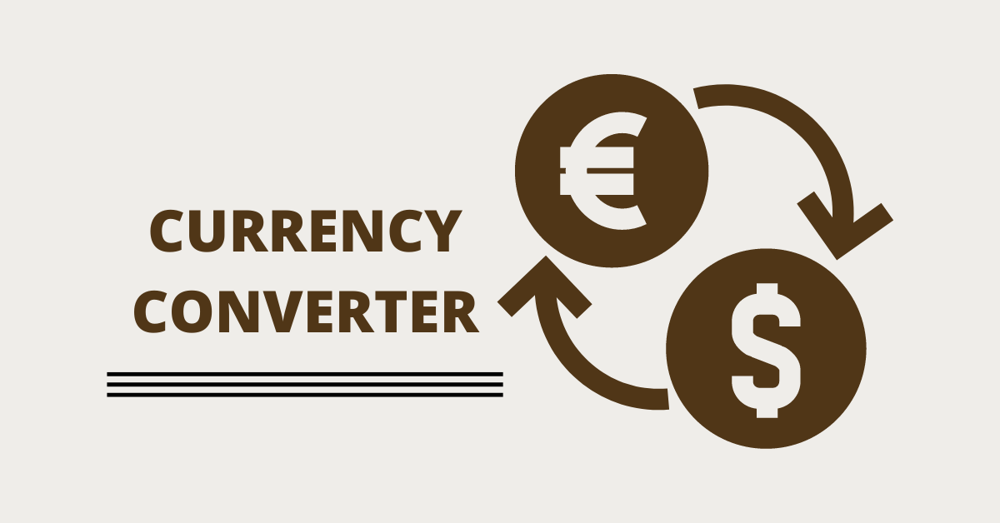

# Krzysztof Biolik Currency converter

This project was bootstrapped with [Create React App](https://github.com/facebook/create-react-app).

## Demo

You can see how the currency converter works in the gif below.

You can try for yourself how the currency exchange works at this link.

[Currency converter link]()

## What does it allow?

This currency converter allows you to convert the amount of money in the zloty currency to other currencies such as the US dollar, British pound and euro. In this case, the exchange rates of individual currencies have been assigned to a given currency as a fixed value.
## How does the currency converter work?

In the currency converter form, enter the amount in the zloty currency that you want to convert (in the "Kwota w zl" field). Then select the currency in which you want to get the amount of money after conversion (in the "Waluta" field) and click the "Recalculate" button (in the "Przelicz" field). The form will return the value entered in PLN and the corresponding value in the currency to which the amount was to be converted. If a negative value is entered, the form will return a message that negative amounts cannot be converted.
## Technologies used in this project

- HTML, BEM convention
- CSS, Normalize.css, Flexbox, Grid
- JavaScript ES6+ features
- React
- Markdown leanguage

## Available Scripts

In the project directory, you can run:

### `npm start`

Runs the app in the development mode.\
Open [http://localhost:3000](http://localhost:3000) to view it in your browser.

The page will reload when you make changes.\
You may also see any lint errors in the console.

### `npm run build`

Builds the app for production to the `build` folder.\
It correctly bundles React in production mode and optimizes the build for the best performance.

The build is minified and the filenames include the hashes.\
Your app is ready to be deployed!

See the section about [deployment](https://facebook.github.io/create-react-app/docs/deployment) for more information.

### `npm run eject`

**Note: this is a one-way operation. Once you `eject`, you can't go back!**

If you aren't satisfied with the build tool and configuration choices, you can `eject` at any time. This command will remove the single build dependency from your project.

Instead, it will copy all the configuration files and the transitive dependencies (webpack, Babel, ESLint, etc) right into your project so you have full control over them. All of the commands except `eject` will still work, but they will point to the copied scripts so you can tweak them. At this point you're on your own.

You don't have to ever use `eject`. The curated feature set is suitable for small and middle deployments, and you shouldn't feel obligated to use this feature. However we understand that this tool wouldn't be useful if you couldn't customize it when you are ready for it.

